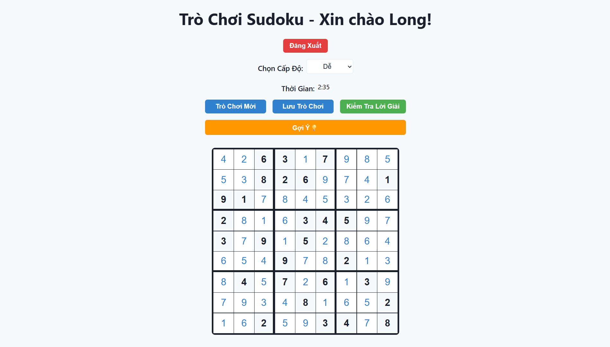

# 🎮 Sudoku Web Game - Fullstack Project

## 🧹 Introduction

This is a **full-stack web project** developed by a third-year student at **Ho Chi Minh City University of Education (HCMUE)**. It is a simple, responsive, and intuitive **Sudoku web game** powered by **ReactJS** on the frontend and **FastAPI** on the backend. The game offers a smooth user experience, game saving, user authentication via email, and logical hints to assist players.

> 🔒 Note: This game currently supports **Vietnamese language only**.



## 🌟 Objectives

* Deliver a clean and user-friendly interface.
* Allow users to **log in**, **save game progress**, and **resume** saved games.
* Provide Sudoku puzzles of varying difficulty.
* Support password reset and email verification via **SMTP**.
* Offer logical **hints** for puzzle-solving.
* Ensure secure user data with **JWT authentication**.

## 👥 Target Users

* Individuals or small groups looking for an engaging Sudoku game.
* Educational or self-practice environments.

---

## 🛠 Technologies Used

### Frontend

* **ReactJS**: For building dynamic UI.
* **React Router**: For SPA routing.
* **TypeScript**: For better code safety and maintainability.
* **Axios**: For making HTTP requests.

### Backend

* **FastAPI**: High-performance Python web framework.
* **SQLite**: Lightweight database for persistent game state and users.
* **SQLAlchemy**: ORM for database interaction.
* **JWT (JSON Web Token)**: Authentication mechanism.
* **SMTP**: Send email for registration and password reset.
* **Pydantic**: Data validation.

---

## ⚙️ System Requirements

* Node.js (for frontend): v18+
* Python: v3.9+
* FastAPI: v0.115.x or later
* SQLite (default) or custom DB setup
* Internet connection for API communication and email verification

---

## 🚀 Setup Instructions

### 1. Create a folder and clone the repositories

```bash
mkdir SudokuGame
cd SudokuGame
git clone https://github.com/quoclong20222428/sudoku-frontend.git
git clone https://github.com/quoclong20222428/sudoku-backend.git
```

### 2. Install Frontend Dependencies

```bash
cd sudoku-frontend
npm install
```

### 3. Install Backend Dependencies

```bash
cd ../sudoku-backend
pip install -r requirements.txt
```

### 4. Configure Environment Variables

Create a `.env` file inside the `sudoku-backend` folder. This file is used to store sensitive credentials for JWT token generation and SMTP email services.

**Example `.env` file:**

```env
# Secret key for JWT authentication
SECRET_KEY=your_random_secret_key_here

# SMTP configuration for email verification and password reset
SMTP_EMAIL=your_email@gmail.com
SMTP_PASSWORD=your_email_app_password
```

> 🔒 **Important Notes:**
>
> * `SECRET_KEY` can be any long random string. You can generate one using Python:
>
>   ```python
>   import secrets
>   print(secrets.token_hex(32))
>   ```
> * For `SMTP_EMAIL`, use a Gmail account or other SMTP-supported provider.
> * **If you're using Gmail**, you must enable **"App Passwords"** in your Google Account and use that password here. Don't use your normal login password.
> * Never commit the `.env` file to version control. Add it to `.gitignore`.

### 5. Run Backend Server

```bash
python -m uvicorn main:app --reload --port 8000
```

### 6. Run Frontend

```bash
cd ../sudoku-frontend
npm run dev
```

---

## 🌟 Main Features

1. **User Authentication**

   * Register, Login, and JWT-based sessions.
   * Email verification using SMTP.

2. **Sudoku Puzzle Generator**

   * Random puzzles with `easy`, `medium`, and `hard` levels.
   * Unique solution guaranteed.

3. **Save & Load Game**

   * Autosave current progress to database.
   * View and manage saved games.

4. **Logical Hint System**

   * Highlights incorrect cells or empty cells with logical reasoning.

5. **Password Recovery**

   * Forgot password flow via email verification.

---

## 👨‍🏫 Usage Guide

1. **Sign Up**: Enter your name, email, and password to register.
2. **Email Verification**: A code is sent to your email. Enter it to verify.
3. **Login**: Access the main game screen.
4. **Start New Game**: Choose a difficulty and begin playing.
5. **Save/Load Game**: You can save your progress and resume later.
6. **Check Solution**: The system verifies if the solution is correct.
7. **Get Hints**: Receive intelligent guidance when stuck.
8. **Reset Password**: Use "Forgot Password" to receive a reset code via email.

---

## 🔮 Development Notes

* Frontend route paths: `/`, `/login`, `/register`, `/forgot-password`
* Backend endpoints:

  * `/register`, `/login`, `/me`, `/forgot-password`, `/reset-password`
  * `/game`, `/game/{user_id}`, `/hint/{game_id}`

---

## 📜 License

This project was developed for study purposes at **Ho Chi Minh City University of Education**.

> Please contact the author before using this project for **commercial purposes**.

---

## 📬 Contact

* **Email**: [longtq090204@gmail.com](mailto:longtq090204@gmail.com)


